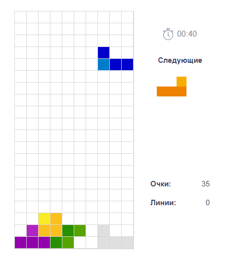

# Браузерная игра "Тетрис"

Учебный проект яндекс-практикума на курсе Мидл фронтенд-разработчик.



## Описание проекта

В данном проекте в учебных целях воспроизведена классическая игра "Тетрис" - одна из самых популярных компьютерных игр всех времен. Игра была столь успешной, что была портирована на множество платформ, включая ПК, консоли, мобильные устройства и даже игровые автоматы. Сегодня Тетрис доступен на большинстве устройств и продолжает оставаться одной из самых популярных игр.


### История

Тетрис (от греческого слова "tetra", что означает "четыре", так как все фигурки в игре состоят из четырех квадратов) — компьютерная игра, первоначально изобретённая и разработанная советским программистом Алексеем Пажитновым 6 июня 1984 года на языке программирования Паскаль на компьютере Электроника-60. 

Работая в Вычислительном центре АН СССР, он занимался проблемами искусственного интеллекта и распознавания речи, а для обкатки идей применял головоломки, в том числе и классическое пентамино. Пытался автоматизировать укладку пентамино в заданные фигурки. Однако вычислительных мощностей тогдашнего оборудования для вращения пентамино не хватало, приходилось отлаживать на тетрамино, что и определило название игры. В тех опытах и родилась основная идея «Тетриса» — чтобы фигурки падали, а заполненные ряды исчезали.


### Описание

"Тетрис" представляет собой головоломку, построенную на использовании геометрических фигур "тетрамино" — разновидности полимино, состоящих из четырёх квадратов. В классическом тетрисе существуют 7 "кирпичиков-тетрамино" тетриса: I, J, L, O, S, T, Z. Все "фигурки-кирпичики" состоят из 4-х одинаковых квадратов. 

Фигурки падают сверху в произвольном порядке и развернутости в ограниченное визуально пространство - "стакан" шириной 10 и высотой 20 клеток.

Игрок с помощью управляющих клавиш может переворачивать, перемещать фигурки по горизонтали и должен складывать их на дно стакана так, чтобы в заполненном ряду не было промежутков. 
Также можно "сбрасывать" фигурку, то есть ускорять её падение, когда уже продумано, куда этот элемент должен встать.

Когда игрок заполняет целый горизонтальный ряд, этот ряд исчезает, и все блоки выше опускаются на один ряд вниз. Если столбец из фигурок достигает верхней границы стакана, игра заканчивается. 


### Функционал MVP игры

- Стакан и падающие в него фигуры 
- Учет и вывод очков за каждую упавшую фигуру
- Перемещение фигур по горизонтали, по часовой и против часовой стрелки, "сброс" фигуры
- Удаление заполненного рядя со смещением блоков ниже на один ряд, учет и вывод дополнительных очков по этому событию
- Окончание игры в случае переполнения стакана


### Дополнительный функционал 

Необязательный дополнительный функционал, который будет реализован частично или полностью по возможности.

- Подключаемый/отключаемый вывод подсказки следующей фигуры (Ctrl + N)
- Подключаемый/отключаемый вывод подсказки места падения фигуры (Ctrl + P) 
- 10 уровней игры, переход на следующий уровень по набранным очкам с ускорением падения фигур
- Вывод количества удаленных рядов
- Вывод времени игры в формате HH:MM:SS


### Управление

Управление происходит через веб-интерфейс и с помощью клавиатуры.

Клавиатура:

- Стрелка влево: сдвигает фигурку влево
- Стрелка вправо: сдвигает фигурку вправо
- Стрелка вниз: ускоряет падение фигурки
- Пробел: поворачивает фигурку на 90 градусов по часовой стрелке
- Ctrl: поворачивает фигурку на 90 градусов против часовой стрелки
- Ctrl + N: подсказка следующей фигуры
- Ctrl + P: подсказка места падения фигуры


## Инсталяция проекта, запуск и тестирование

## Как запускать?

1. Убедитесь что у вас установлен `node` и `docker`
2. Выполните команду `yarn bootstrap` - это обязательный шаг, без него ничего работать не будет :)
3. Выполните команду `yarn dev`
3. Выполните команду `yarn dev --scope=client` чтобы запустить только клиент
4. Выполните команду `yarn dev --scope=server` чтобы запустить только server


## Как добавить зависимости?
В этом проекте используется `monorepo` на основе [`lerna`](https://github.com/lerna/lerna)

Чтобы добавить зависимость для клиента 
```yarn lerna add {your_dep} --scope client```

Для сервера
```yarn lerna add {your_dep} --scope server```

И для клиента и для сервера
```yarn lerna add {your_dep}```


Если вы хотите добавить dev зависимость, проделайте то же самое, но с флагом `dev`
```yarn lerna add {your_dep} --dev --scope server```


## Тесты

Для клиента используется [`react-testing-library`](https://testing-library.com/docs/react-testing-library/intro/)

```yarn test```

## Линтинг

```yarn lint```

## Форматирование prettier

```yarn format```

## Production build

```yarn build```

И чтобы посмотреть что получилось


`yarn preview --scope client`
`yarn preview --scope server`

## Хуки
В проекте используется [lefthook](https://github.com/evilmartians/lefthook)
Если очень-очень нужно пропустить проверки, используйте `--no-verify` (но не злоупотребляйте :)

## Ой, ничего не работает :(

Откройте issue, я приду :)

## Автодеплой статики на vercel
Зарегистрируйте аккаунт на [vercel](https://vercel.com/)
Следуйте [инструкции](https://vitejs.dev/guide/static-deploy.html#vercel-for-git)
В качестве `root directory` укажите `packages/client`

Все ваши PR будут автоматически деплоиться на vercel. URL вам предоставит деплоящий бот

## Production окружение в докере
Перед первым запуском выполните `node init.js`


`docker compose up` - запустит три сервиса
1. nginx, раздающий клиентскую статику (client)
2. node, ваш сервер (server)
3. postgres, вашу базу данных (postgres)

Если вам понадобится только один сервис, просто уточните какой в команде
`docker compose up {sevice_name}`, например `docker compose up server`